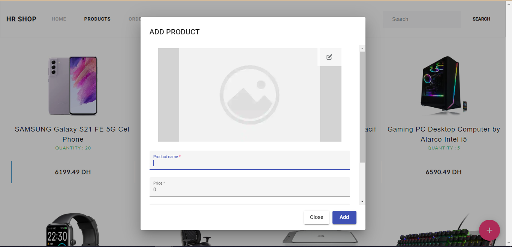
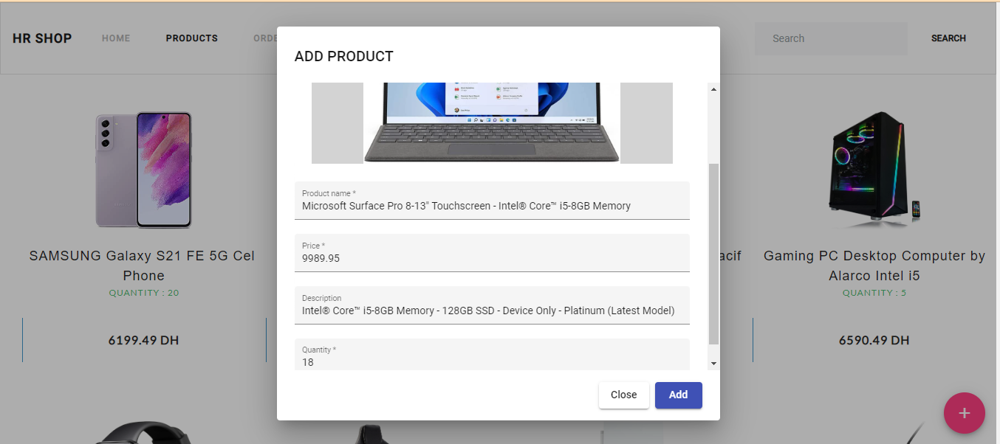
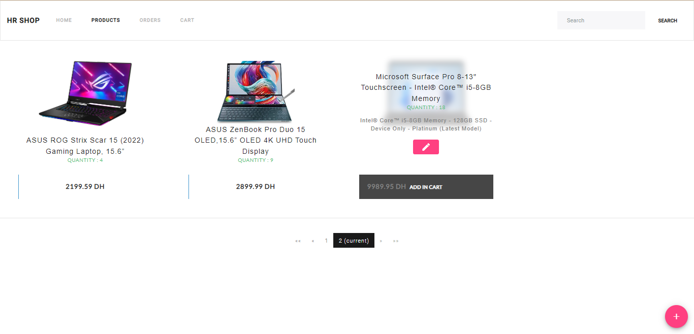
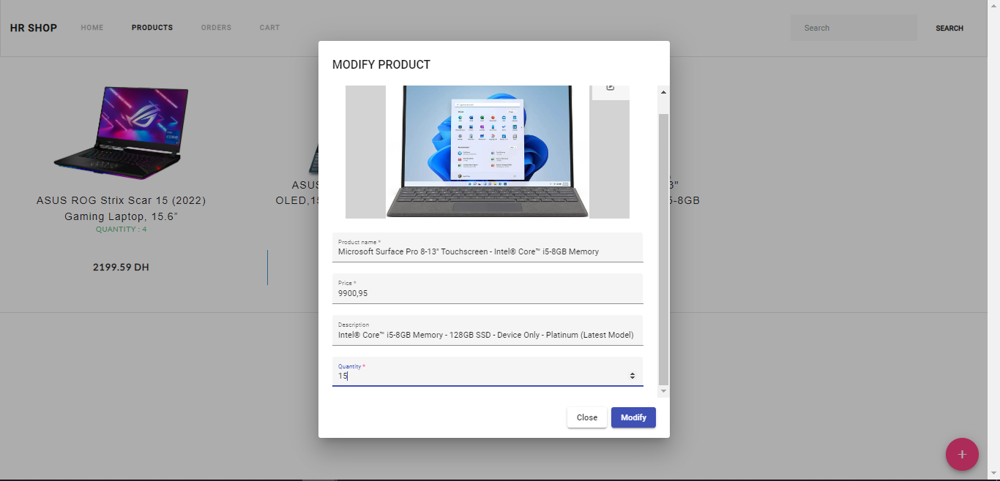
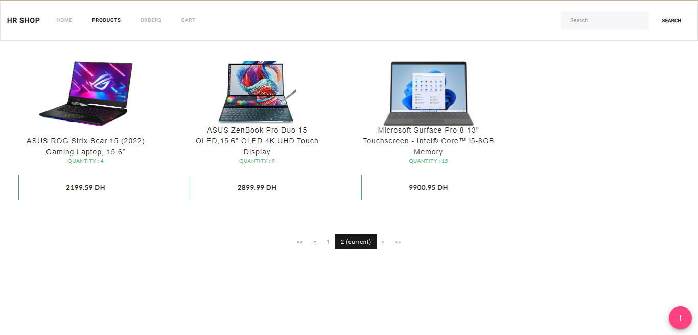
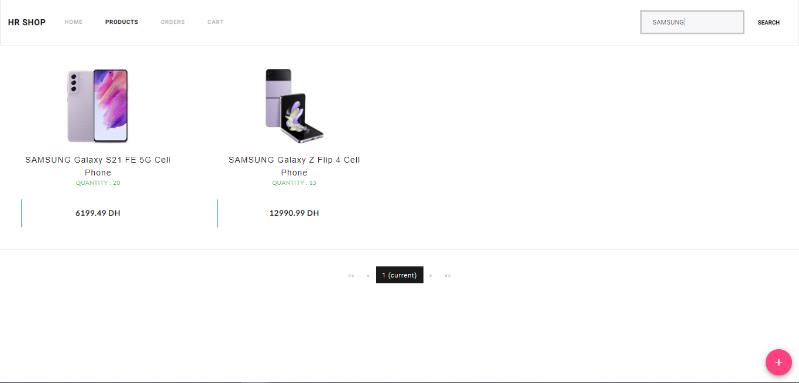
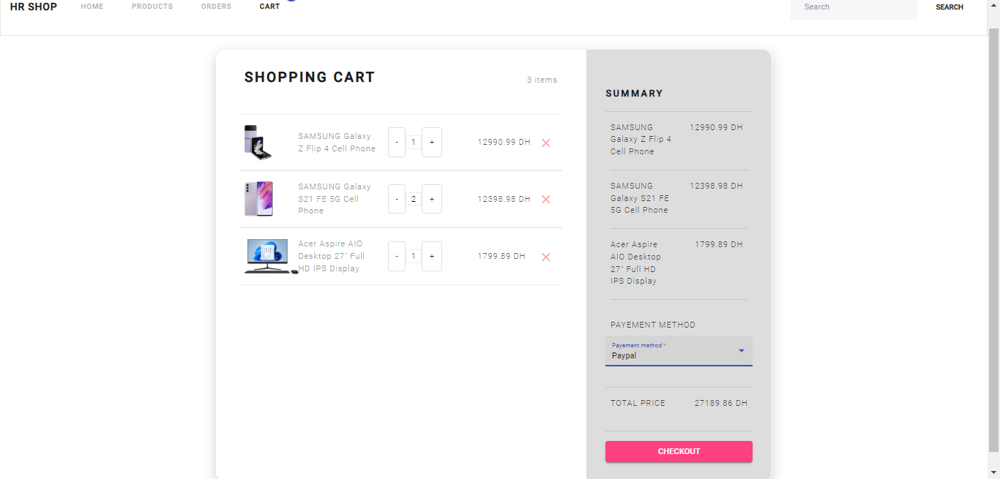
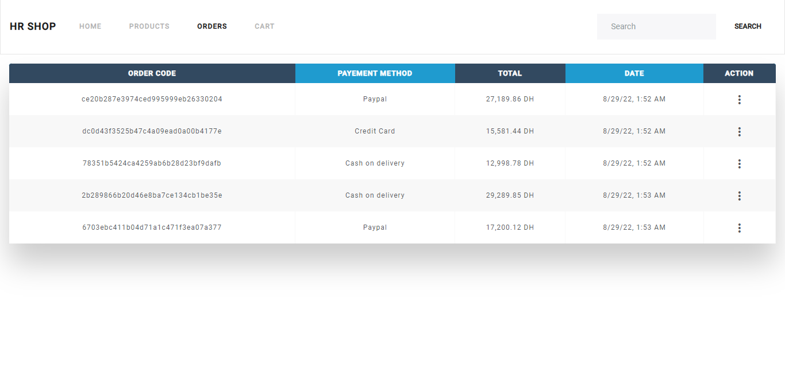
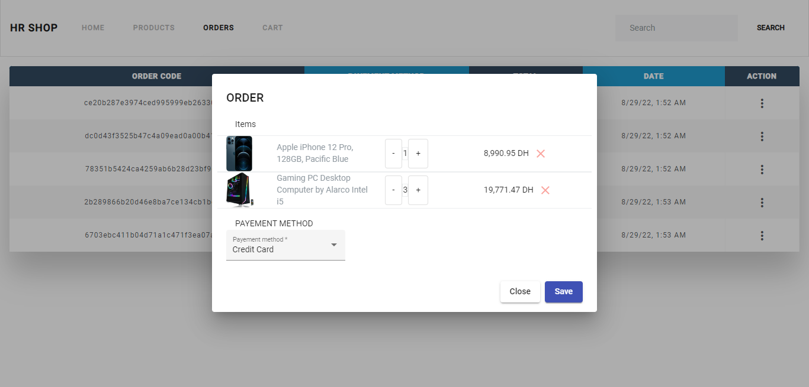

# ECOM

Application de gestion des produits, de panier et passer les commandes
\
Réakisée avec Spring boot et Angular

## Demo

Interface de l'application

### Ajouter un produit

### Modifier produit

### Chercher un produit

### Ajouter au panier

### Completer la commande

### List des commandes

### Modifier la commande

## Authors

- [@HayarHamza](https://github.com/hamzahr477)
